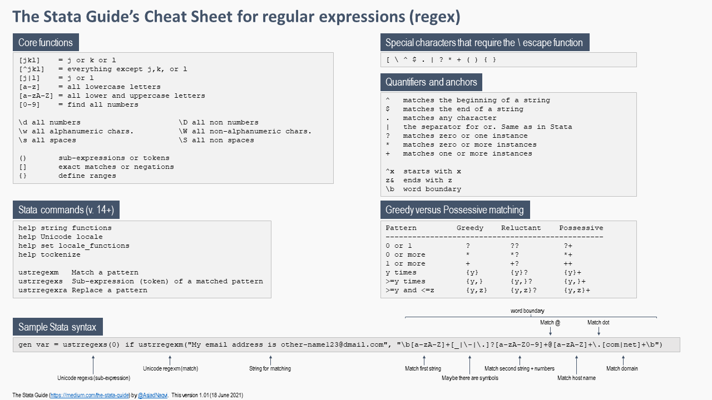

# Welcome to the Stata Guide!

This folder contains various files for [The Stata Guide on Medium](https://medium.com/the-stata-guide). 

### The list of guides (date published in brackets)

The guide will resume in Dec 2021 after I am done with the [#30DayMapChallenge](https://github.com/tjukanovt/30DayMapChallenge). You can see some of my entries in the [folder](/30DayMapChallenge2021) above. 

[Stata graphs: Sankey diagram](https://medium.com/the-stata-guide/stata-graphs-sankey-diagram-ecddd112aca1) *(26-Oct-21)*

[Stata graphs: Waffle charts](https://medium.com/the-stata-guide/stata-graphs-waffle-charts-32afc7d6f6dd) *(12-Oct-21)*

[Stata graphs: Arc plots](https://medium.com/the-stata-guide/stata-graphs-arc-plots-eb87015510e6)	*(06-Oct-21)*

[Welcome to the Stata Guide](https://medium.com/the-stata-guide/welcome-to-the-stata-guide-12adf81ec3d)	*(15-Sep-21)*

[The Art of the Code](https://medium.com/the-stata-guide/the-art-of-the-code-e3d44efd84cb)	*(27-Aug-21)*

[Maps in Stata II](https://medium.com/the-stata-guide/maps-in-stata-ii-fcb574270269)	*(10-Aug-21)* *(updated: 19-Oct-21)*

[Stata graphs: Rose (Coxcomb) plots](https://medium.com/the-stata-guide/stata-graphs-rose-coxcomb-plots-5a8af366b39b)	*(19-Jul-21)*

[Maximum Likelihood Estimation (MLE)](https://medium.com/the-stata-guide/maximum-likelihood-estimation-mle-88b869158a7d)	*(05-Jul-21)*

[Mata: Stata’s End Game](https://medium.com/the-stata-guide/mata-statas-end-game-5983c0ee11bd) [Cheatsheet](MATA_cheatsheet_v3.pdf)	*(24-Jun-21)*

[The Stata Workflow Guide](https://medium.com/the-stata-guide/the-stata-workflow-guide-52418ce35006)	*(07-Jun-21)*

[Stata and GitHub Integration](https://medium.com/the-stata-guide/stata-and-github-integration-8c87ddf9784a)	*(27-Apr-21)*

[Advanced Mapping with Stata: OpenStreetMap (OSM) and QGIS](https://medium.com/the-stata-guide/advanced-mapping-with-stata-openstreetmap-osm-and-qgis-412c04d8ddd1)	*(19-Apr-21)*

[Stata schemes](https://medium.com/the-stata-guide/stata-schemes-5ef99d099585)	*(13-Apr-21)*

[Stata graph replication: The Du Bois Challenge](https://medium.com/the-stata-guide/graph-replication-the-du-bois-challenge-f0db93e719e6) [Additional files](https://github.com/asjadnaqvi/DuBoisChallenge-Stata)	*(31-Mar-21)*

[Stata graphs: Reprogramming maps](https://medium.com/the-stata-guide/stata-graphs-reprogramming-maps-204f9ec3f2e4)	*(30-Mar-21)*

[Stata graphs: Spirals and text wrapping](https://medium.com/the-stata-guide/stata-graphs-spirals-and-text-wrapping-628ea333cc21)	*(29-Mar-21)*

[Regular expressions (regex) in Stata](https://medium.com/the-stata-guide/regular-expressions-regex-in-stata-6e5c200ef27c) [Cheatsheet](Stata_regex_cheatsheet_v1.pdf)	*(17-Mar-21)*

[Stata graphs: Programming pie charts from scratch](https://medium.com/the-stata-guide/stata-graphs-programming-pie-charts-from-scratch-bddcfc689034)	*(10-Mar-21)*

[The Stata-to-LaTeX guide](https://medium.com/the-stata-guide/the-stata-to-latex-guide-6e7ed5622856)	*(25-Feb-21)*

[Stata graphs: Hearts ♥](https://medium.com/the-stata-guide/i-stata-391736dc6bad)	*(14-Feb-21)*

[Stata graphs: Symbols](https://medium.com/the-stata-guide/stata-graphs-using-symbols-in-figures-be3fc26161ff)	*(08-Feb-21)*

[Stata graphs: Spider plots](https://medium.com/the-stata-guide/stata-graphs-spider-plots-613808b51f73)	*(26-Jan-21)*

[Stata graphs: Polar (Radial) Plots](https://medium.com/the-stata-guide/stata-graphs-polar-radial-plots-c19e705b56aa) *(19-Jan-21)*

[Stata graphs: How to add arrows to your line graphs](https://medium.com/the-stata-guide/stata-graphs-how-to-add-arrows-to-your-line-graphs-69c1c08949c7)	*(07-Jan-21)*

[Why the Stata Guide on Medium?](https://medium.com/the-stata-guide/why-the-stata-guide-on-medium-4b9b9d00a172)	*(12-Dec-20)*

[COVID-19 visualizations with Stata Part 10: Stream graphs](https://medium.com/the-stata-guide/covid-19-visualizations-with-stata-part-10-stream-graphs-9d55db12318a)	*(09-Dec-20)*

[COVID-19 visualizations with Stata Part 9: Customized bar graphs](https://medium.com/the-stata-guide/covid-19-visualizations-with-stata-part-9-customized-bar-graphs-dde096567837)	*(01-Dec-20)*

[Stata graphs: Define your own color schemes](https://medium.com/the-stata-guide/stata-graphs-define-your-own-color-schemes-4320b16f7ef7)	*(23-Nov-20)*

[Stata graphs: Hex maps of the 2020 USA Presidential elections](https://medium.com/the-stata-guide/stata-graphs-hex-maps-of-the-2020-usa-presidential-elections-ce106f6f8095)	*(09-Nov-20)*

[Stata graphs: Get those fonts right](https://medium.com/the-stata-guide/stata-graphs-get-those-fonts-right-c38d35625142)	*(03-Nov-20)*

[COVID-19 visualizations with Stata Part 8: Ridgeline plots (Joy plots)](https://medium.com/the-stata-guide/covid-19-visualizations-with-stata-part-8-joy-plots-ridge-line-plots-dbe022e7264d)	*(30-Oct-20)*

[COVID-19 visualizations with Stata Part 7: Doubling time graphs](https://medium.com/the-stata-guide/covid-19-visualizations-with-stata-part-7-doubling-time-graphs-1-58b7687cbdc0)	*(10-Oct-20)*

[Automating Eurostat in Stata](https://medium.com/the-stata-guide/automating-eurostat-in-stata-part-1-a047941b2b4f)	*(01-Oct-20)*

[COVID-19 visualizations with Stata Part 6: Animations](https://medium.com/the-stata-guide/covid-19-visualizations-with-stata-part-6-animations-f9d2b09985c2)	*(23-Sep-20)*

[COVID-19 visualizations with Stata Part 5: Stacked area graphs](https://medium.com/the-stata-guide/covid-19-visualizations-with-stata-part-5-stacked-area-graphs-ed976d025365)	*(16-Sep-20)*

[COVID-19 visualizations with Stata Part 4: Maps](https://medium.com/the-stata-guide/covid-19-visualizations-with-stata-part-4-maps-fbd4fe2642f6)	*(07-Sep-20)*

[COVID-19 visualizations with Stata Part 3: Heat plots](https://medium.com/the-stata-guide/covid-19-visualizations-with-stata-part-3-heat-plots-e2ef5ac1160b)	*(02-Sep-20)*

[COVID-19 visualizations with Stata Part 2: Customizing color schemes](https://medium.com/the-stata-guide/covid-19-visualizations-with-stata-part-2-customizing-color-schemes-206af77d00ce)	*(29-Aug-20)*

[COVID-19 visualizations with Stata Part 1: An Introduction to data setup and customized graphs](https://medium.com/the-stata-guide/covid-19-data-visualization-with-stata-part-1-an-introduction-to-data-setup-and-customized-6b879a1e8647)	*(25-Aug-20)*

### The Du Bois Challenge in Stata

Article here: [Graph replication: The Du Bois Challenge](https://medium.com/the-stata-guide/graph-replication-the-du-bois-challenge-f0db93e719e6)

Files here: https://github.com/asjadnaqvi/DuBoisChallenge-Stata

### Stata graph schemes
https://github.com/asjadnaqvi/Stata-schemes

### Cheat Sheets

[Regular Expressions Cheatsheet](Stata_regex_cheatsheet_v1.pdf)

[Mata Cheatsheet](MATA_cheatsheet_v3.pdf)

### Stata UK conference 2021 presentation

[Presentation](./presentations/Stata_viz_2021.pdf)

### Have questions?

Hop in the [The Code Block](https://discord.gg/qpHZtX6Xkk) Discord server and ask your questions!

I get a lot of e-mails with code and data files and now it is hard to keep track on who is requesting what. At least in Discord several people can answer your questions. This also helps document the problems for other people.

### How can you support the guides?

These guides are meant as a public service and I really enjoy writing them and getting feedback from you guys. 

But if you want to support the content creation, then you can:

(a) become a member on [Medium](https://medium.com) and subscribe and read the guides. This gives you access to a lot of other awesome content as well.

or 

(b) you can:
 

These options are completely optional :sunglasses:
